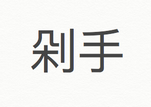

剁手  duò shǒu

What: 剁手 means to shop online. Used to have a derogatory tone (think shop compulsively, shopping spree etc) but now simply 

Why: 剁 duò means to cut off usu. a body part and here hands...which makes it hard to click

How:
1.       https://www.mdbg.net/chinese/dictionary?page=worddict&wdrst=0&wdqb=%E5%89%81%E6%89%8B++du%C3%B2+sh%C7%92u

