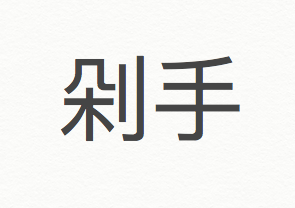

剁手  duò shǒu

What: 剁手 means to shop compulsively

When: When you can't resist 11/11, only chopping off your own hands can save you.

Why:

How:
1.       https://www.mdbg.net/chinese/dictionary?page=worddict&wdrst=0&wdqb=%E5%89%81%E6%89%8B++du%C3%B2+sh%C7%92u

