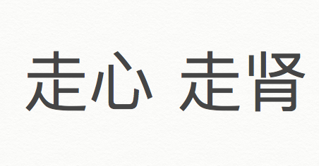

走心（zou xin）; 走肾（zou shen）
Today we talk about 2 opposite types of person, usually be mentioned together.
1.       走心：From your heart. 
Someone devote a lot feelings, needs a strong emotional connection to finally experience sexual attraction with someone.
It can also be used daily basis, describe do your presentation sincerely, strong dedication involved, don’t care about the payback that much.
2.       走肾：From your kidney. 
Someone only cares about his physical needs, doesn’t need emotional connection involved to be intimate with someone.

