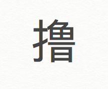

What?
撸 originally was slang for jerk off: 撸管lǔ Guǎn， rub the tube. 

Now it basically subs for the verb “do” when describing any kind of enjoyable, time-consuming, concentration oriented actions.
 
Why?
This change came from when the video game League of Legends got popular, players instead of saying play the game, they say “撸啊撸” which is also used as the nickname of LOL later. Since the nickname frequently used in the public, we generally forget the its meaning of masturbation. Instead, it can be used to describe any sort of long time-consuming actions.
 
How?	
撸串 lǔ chuàn / 撸猫 lǔ māo 

今晚我们去撸串儿吧

(Lets eat chuanchuan tonight)

要不要来我家撸猫
(Do you wanna come over n pet my cat?)

